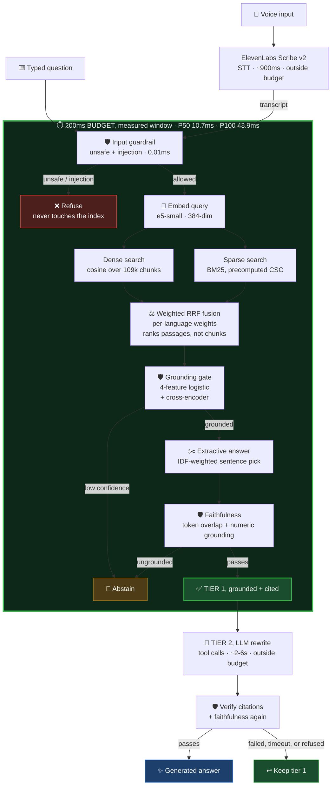
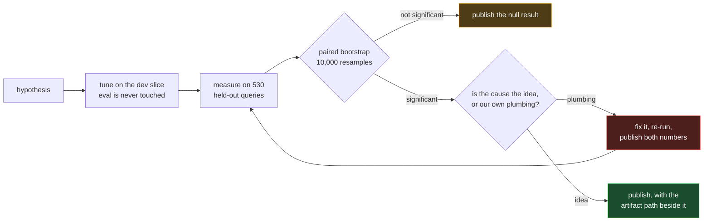
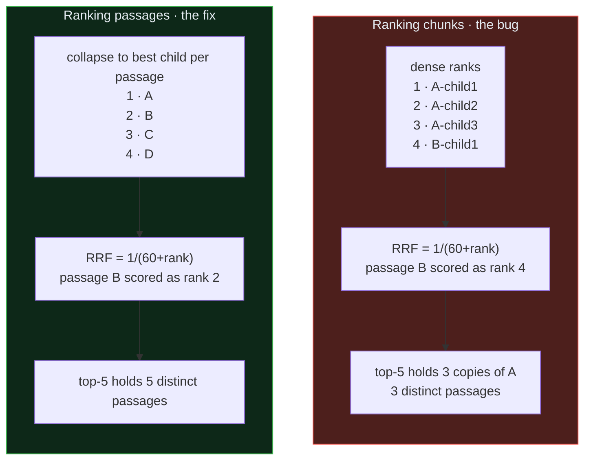
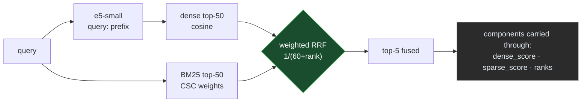
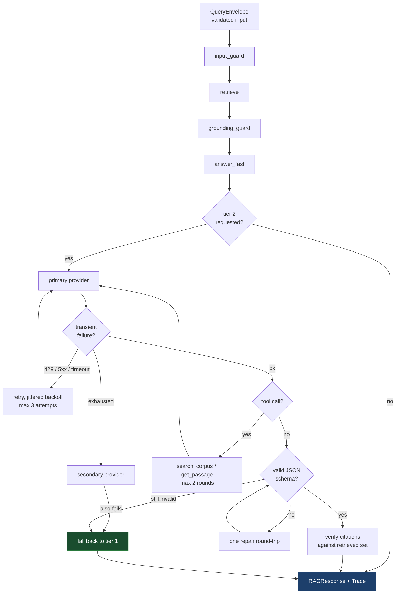
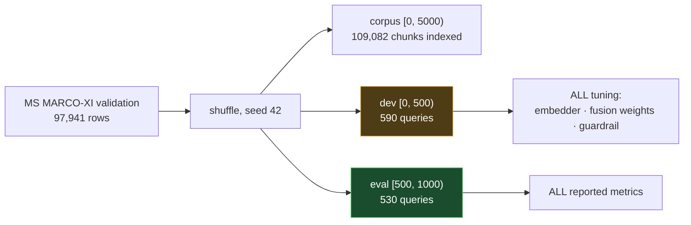

# hhgoa: Voice RAG for Hindi and Gujarati

Speak a question in Hindi or Gujarati; get a grounded, cited answer from a
109,082-chunk [MS MARCO-XI](https://huggingface.co/datasets/ai4bharat/MSMARCO-XI)
index in **10.7 ms at P50**.

Built for **HH Goa 2026 Shortlisting Task 2** by **Team Deploy For Good**.

Corpus: [ai4bharat/MSMARCO-XI](https://huggingface.co/datasets/ai4bharat/MSMARCO-XI)
· Speech-to-text: ElevenLabs Scribe v2

---

## Headline numbers

300 held-out queries plus 150 guardrail queries, one at a time, no batching,
warm process:

| Metric | Value | Budget |
|---|---:|---|
| **P50** | **10.72 ms** | 200 ms |
| **P70** | **11.61 ms** | 200 ms |
| **P100** | **43.85 ms** | 200 ms |
| Queries inside budget | **450 / 450** | |

The measured window is **transcript in, answer out**, matching the task's
wording: *"chunking + vector DB retrieval + everything through to final
output."* Speech-to-text and LLM generation are network calls and are reported
separately below, never folded into this number.

```bash
./hhgoa bench --queries 300
```

---

## Architecture

Requirement 1 mandates a hosted speech-to-text provider. Ours measures **~900 ms**,
which is 4.5x the entire 200 ms budget before any retrieval happens, and an LLM
generation call adds 2 to 6 seconds more. So "under 200 ms" cannot mean
microphone to answer. It can only mean the part of the pipeline we build and
control, which is what the number above measures, with every stage timed and the
network legs reported separately rather than hidden.

That constraint produces the design:



### The one decision that matters

**Tier 1 is computed before generation and never depends on it.** One choice,
three consequences:

- The sub-200 ms claim becomes *measurable*, because the tier-1 answer is a real
  grounded, citable answer rather than a placeholder or a passage dump.
- It **is** the error-recovery path. An LLM timeout, a 429, malformed JSON, a
  refused citation check: each leaves a real answer standing. Recovery here is a
  second answer already computed, not a `try/except` returning an error string.
- The demo feels instant. The answer appears in ~12 ms and improves in place a
  few seconds later.

The UI shows both tiers with their own timings, so the budget claim and the
generation cost are never conflated.

---

## How a number gets into this README

Every figure below survived this loop. It is also the reason the `parent_child`
row changed twice: the first measurement was real, and the cause was ours.



Two rules fall out of it, and both cost us results we would rather have shown:

- **A null result is a result.** No chunking strategy beats the plain baseline
  significantly, and that is what the table says.
- **Rule out your own bugs before blaming the idea.** `parent_child` looked
  11.7 pp worse than baseline. Two thirds of that was our retrieval code.
- **Select on dev, report on eval.** The per-language chunk window that eval
  seemed to justify did not replicate on dev, so it is not in the repo.

---

## Requirements to implementation

| # | Requirement | Where | Evidence |
|---|---|---|---|
| 1 | Speech-to-text (Sarvam / ElevenLabs) | `core/stt/elevenlabs.py` | ElevenLabs **Scribe v2**, verified live in hi + gu |
| 2 | Chunking must be vast | `core/chunking/` | 6 strategies, [ablation](#2-chunking) with bootstrap |
| 3 | Under 200 ms | `core/harness/orchestrator.py` | **P100 43.9 ms, 450/450 inside budget** |
| 4 | P50 / P70 / P100 | `bench/runner.py` | [below](#34-latency) |
| 5 | Harness | `core/harness/` | tool calls, retries, typed I/O, failover |
| 6 | Guardrails | `core/guardrails/` | [below](#6-guardrails), 54/54 adversarial caught |

---

## 1. Speech-to-text

ElevenLabs **Scribe v2**. Verified end to end in both languages, from real audio
through retrieval to a grounded answer:

| clip | transcript | retrieved | correct family |
|---|---|---|---|
| `hi_01.wav` | बीमा समाधान क्या है? | `hi_180145_p3` | yes |
| `gu_01.wav` | વીમા રિઝોલ્યુશન શું છે? | `gu_1053197_p2` | yes |
| `gu_02.wav` | સૌથી વધુ રોકડ પુરસ્કાર **credit cards** | `gu_202006_p4` | yes |

`gu_02` is the most useful fixture. Scribe returns the loanword "ક્રેડિટ કાર્ડ્સ"
in Latin script, which is realistic code-mixed ASR output and exactly what breaks
a dense-only retriever. Retrieval still lands on the right passage because BM25
matches the Latin token while the dense half carries the Gujarati context.
**Hybrid retrieval earns its keep on the voice path, not just on the benchmark.**

Fixtures are synthetic TTS, so they are cleaner than human speech. They verify
the pipeline; they are not a WER benchmark. See
[data/samples/audio/README.md](data/samples/audio/README.md).

### Streaming was measured and rejected

STT is ~1,090 ms and, once the pipeline reached 9.6 ms, **99% of what a user
actually waits for**. ElevenLabs ships a realtime WebSocket model, so it was
the obvious next win. Streamed against the same fixtures it returns a final
transcript **238 ms after the last audio chunk instead of 1,090 ms**, a 4.6x
improvement.

It is not shipped, because it cannot tell the two languages apart:

| speech-to-text path | language correct | final transcript |
|---|---:|---:|
| realtime WebSocket, auto-detect | **53%** | 238 ms |
| **batch, auto-detect (shipped)** | **94%** | 1,090 ms |

Measured over 32 synthesized clips from held-out queries, 16 per language.
Realtime transcribes Gujarati audio into Devanagari ("સૌથી વધુ" comes back as
"सौ तीन वधु"), and one partial arrived in Arabic. Passing `language_code=gu`
fixes it completely, but that means asking the speaker to declare their
language, which is the thing the next section removes.

Transcribing both ways and letting retrieval pick the better transcript scored
**59%**, barely above chance, so that idea was dropped too. A 4.6x latency win
is not worth a coin flip on which language the user is speaking.

### The English shown beside an answer is not a translation

MS MARCO-XI is a translation *of* English MS MARCO, and every row ships
`English_passages` index-aligned with `Translated_passages`. So the English
under each answer is the text the passage was translated **from**, pulled
straight from the dataset:

```
अपस्फीत शिराएँ ऐसी शिराएँ हैं जो रक्त से सूजी हुई हैं ...
What are varicose veins? Varicose veins are veins that have become swollen ...
```

Nothing is generated, so nothing can drift from what the corpus says, and it
costs no latency. It lives in a side file rather than the index, because the
indexer deliberately does not persist English text: it would roughly double a
105 MB `chunks.json` and the RAM behind it, and retrieval never reads it.
Missing file simply means no English is shown.

```bash
uv run python scripts/build_english_map.py   # data/index/passages_en.json, 32 MB
```

### Nobody should have to declare their language

Devanagari (U+0900-U+097F) and Gujarati (U+0A80-U+0AFF) are disjoint Unicode
blocks, so the script a question is written in *is* its language. There is no
model and no ambiguity, which is why the UI has no language selector:

```
बीमा समाधान क्या है       -> hi
વીમા સમાધાન શું છે        -> gu
2026 में World Cup कहाँ   -> hi   (Latin loanwords ignored)
bima samadhan kya hai    -> None -> falls back to DEFAULT_LANGUAGE
USA टपाल टिकटની કિંમત     -> gu   (mixed script, Devanagari in the majority)
```

That last case is why this is **not a majority vote**. Scribe regularly returns
a transcript mixing both scripts for Gujarati audio, and Devanagari can hold the
majority in one while the utterance is plainly Gujarati. Hindi is never written
in the Gujarati block, so a meaningful share of Gujarati characters settles it.
Measured on the 32 clips above, majority scores **87.5%** against **93.8%** for
the share rule, with Hindi unaffected at 16/16.

For voice, Scribe is asked to detect the language rather than being told it, and
the transcript's script then settles it. A provider's language label can be
wrong; the script cannot.

This is not cosmetic. The language selects the fusion weights (hi=0.95,
gu=0.50), the refusal message, and which passage the answer is quoted from, so a
wrong language is a wrong answer. [core/text.py](core/text.py).

---

## 2. Chunking

Six strategies, swappable via `CHUNKING_PROVIDER`:

| strategy | idea |
|---|---|
| `fixed` | character windows with overlap |
| `semantic` | sentence-boundary packing, danda-aware |
| `metadata` | atomic MS MARCO passages, semantic fallback when long |
| `recursive` | separator cascade: paragraph, danda, clause, char |
| `parent_child` | embed 2-sentence children, resolve to the parent passage |
| `token_window` | window sized in e5 **tokens**, not characters |

**Measured, 530 held-out queries, paired bootstrap (10,000 resamples):**

| strategy | chunks | fan-out | hit@5 | MRR | hi | gu | vs fixed |
|---|---:|---:|---:|---:|---:|---:|---|
| **fixed** | 109,082 | 1.09 | **0.6377** | 0.4113 | 0.7170 | **0.5585** | baseline |
| semantic | 107,861 | 1.08 | 0.6358 | **0.4136** | 0.7170 | 0.5547 | -0.002 (p=0.82) |
| metadata | 107,861 | 1.08 | 0.6358 | **0.4136** | 0.7170 | 0.5547 | -0.002 (p=0.82) |
| recursive | 108,876 | 1.09 | 0.6302 | 0.4093 | 0.7132 | 0.5472 | -0.008 (p=0.13) |
| token_window | 111,093 | 1.11 | 0.6283 | 0.4060 | 0.7057 | 0.5509 | -0.009 (p=0.12) |
| parent_child | 236,950 | 2.37 | 0.6019 | 0.3929 | 0.6906 | 0.5132 | -0.036 (p=0.0010) |

"Fan-out" is chunks per source passage. It is in the table because it turned out
to be the thing that decided the ranking, for a reason that had nothing to do
with chunking.

### The null result

**The plain baseline wins and nothing beats it significantly.** MS MARCO ships
pre-segmented passages averaging ~300 characters, so a 512-character window
already keeps almost every passage intact. The sophisticated splitters are
solving a problem this corpus does not have. `semantic` and `metadata` are
byte-identical for the same reason: both collapse to "emit the passage".

Reporting that is more useful than a table engineered to make a clever strategy
look good.

### The bug that was in the table, not the strategy

An earlier version of this table put `parent_child` last by a mile: 0.4887
against a 0.6057 baseline, -11.7 pp. The stated cause was that children of one
passage crowd each other out of the top-5.

That was true, and it was **our retrieval code's fault, not the strategy's**.
Two defects, both of which scale with fan-out:

1. **Rank contamination.** Reciprocal Rank Fusion scores `1/(60 + rank)` on
   *chunk* ranks. Siblings holding ranks 1-3 push the next distinct passage to
   rank 4, so a fan-out chunker's second-best passage was scored as though it
   were fourth.
2. **Pool starvation.** `candidate_k = 50` counted *chunks*. Measured on this
   corpus, a 50-chunk pool held 47.8 distinct passages under `fixed` but only
   **35.3** under `parent_child`. The strategies were not being given the same
   number of passages to choose from.

Neither is a property of small-to-big retrieval. Both are fixed in
[core/retriever/base.py](core/retriever/base.py): candidates collapse to one
best chunk per passage *before* ranks are assigned, and the budget is counted in
passages, so `candidate_k` means the same thing for every chunker.



Collapsing first also lets a passage combine its dense and lexical evidence when
the two retrievers nominate different children of it, which chunk-level fusion
could not do: it scored those children separately and gave neither the sum.

The ablation is the whole argument, and its size tracks fan-out exactly:

| strategy | fan-out | chunk-level | passage-level | delta | p |
|---|---:|---:|---:|---:|---:|
| parent_child | 2.37 | 0.5717 | 0.6019 | **+0.0302** | 0.0022 |
| semantic | 1.08 | 0.6226 | 0.6358 | +0.0132 | 0.0022 |
| metadata | 1.08 | 0.6226 | 0.6358 | +0.0132 | 0.0022 |
| fixed | 1.09 | 0.6321 | 0.6377 | +0.0057 | 0.10 |
| recursive | 1.09 | 0.6245 | 0.6302 | +0.0057 | 0.25 |
| token_window | 1.11 | 0.6264 | 0.6283 | +0.0019 | 0.83 |

```bash
# --reuse-index scores against indexes already built, skipping a 6x re-ingest
./hhgoa chunk-compare --reuse-index --ablate-dedupe
```

### What `parent_child` actually does, once measured fairly

Two things were wrong with the original row, and separating them matters:

| | hit@5 | vs fixed |
|---|---:|---:|
| as first published (2-sentence children, chunk-level ranking) | 0.4887 | -11.7 pp |
| after the ranking fix (2-sentence children) | 0.5962 | -4.2 pp |
| after choosing the window on dev (3-sentence children) | **0.6019** | **-3.6 pp** |

Two thirds of the original gap was our plumbing. The rest is real.

### Does Gujarati want wider children?

That was the open question: `parent_child` splits a passage into short windows,
and e5-small is weak on Gujarati (0.438 hit@5 against 0.698 on Hindi), so
perhaps two sentences is less text than that encoder can place. Swept with
`child_stride` fixed at 1, so window size is the only variable:

| window | chunks | dev hi | dev gu | eval hi | eval gu |
|---|---:|---:|---:|---:|---:|
| 2 sentences | 302,522 | 0.6881 | 0.4712 | **0.7208** | 0.4717 |
| 3 sentences | 236,950 | **0.7051** | **0.5085** | 0.6906 | **0.5132** |

**Gujarati: yes.** +3.7 pp on dev, **+4.2 pp on eval (p=0.021)**. The hypothesis
holds, and it holds on both slices.

**Hindi: the mirror claim does not survive.** On eval, narrow children look
better for Hindi by 3.0 pp, which is exactly the per-language split we expected
to find. Dev says the opposite, preferring wide children by 1.7 pp. One slice
cannot overrule the other, and the eval-side effect is not significant anyway
(p=0.072), so **there is no per-language window in this repo.** Dev picks a
single window of 3 and that is the default.

That is the whole argument for the dev/eval split, in one table. Selecting on
eval would have produced a confident, published, per-language chunker justified
by a difference that does not replicate.

The strategy still loses to the baseline overall (-3.6 pp, p=0.0010), so `fixed`
remains the shipping chunker. What changed is that the number now measures the
idea instead of our code.

```bash
./hhgoa child-sweep --sizes 2 3 --reuse-index
```

### The tokenizer bug underneath all of it

Python's `\w` does not match Indic combining marks, because matras are Unicode
categories Mn/Mc and `str.isalnum()` is False for them. Tokenizing Devanagari
with a bare `\w+` shatters words:

```
हैबर   ->  ['ह', 'बर']       # BM25 would index consonant fragments
Delhi  ->  ['Delhi']          # English unaffected, which is how it hides
```

A second trap sits inside the fix: the danda `।` (U+0964) lives *inside* the
Devanagari block, so a naive `[ऀ-ॿ]+` range glues sentence-final
punctuation onto the word and `है।` never matches `है`.

Both are handled in [core/text.py](core/text.py), which is the single tokenizer
shared by chunking, BM25, and the guardrails so they cannot drift apart.

### Script fairness

`token_window` exists because character counts are not comparable across
scripts. Measured on this corpus:

| language | chars/passage | tokens/passage | chars/token | 512 chars = |
|---|---:|---:|---:|---:|
| Gujarati | 293.4 | 103.1 | 2.85 | **180 tokens** |
| Hindi | 306.6 | 92.5 | 3.31 | **154 tokens** |

A fixed 512-character window is a **16% larger effective window for Gujarati
than for Hindi**, a confound sitting underneath every character-based comparison
in this table. Sizing in tokens removes it. It did not win, but the measurement
is the point.

---

## Retrieval



| retriever | hit@5 | recall@5 | MRR | hi | gu |
|---|---:|---:|---:|---:|---:|
| dense | 0.5679 | 0.5579 | 0.3686 | 0.6981 | 0.4377 |
| sparse (BM25) | 0.4491 | 0.4412 | 0.2869 | 0.4679 | 0.4302 |
| **hybrid (RRF)** | **0.6377** | **0.6261** | **0.4113** | **0.7170** | **0.5585** |

**+7.0 pp hit@5 (p<0.0001), +4.3 pp MRR (p=0.0006)** over dense.

### A single global fusion weight is the wrong abstraction

With a uniform weight, hybrid retrieval looks like a wash overall
(+2.8 pp, p=0.15). That average hides two **significant and opposite** effects:

| | Hindi | Gujarati |
|---|---|---|
| uniform w=0.5 | **-6.4 pp, p=0.0062** | **+12.1 pp, p<0.0001** |

e5-small is strong on Hindi (0.698) and weak on Gujarati (0.438). Where dense is
already strong, lexical candidates mostly add noise. Where it is weak, BM25
genuinely rescues it.

Sweeping the dense weight on the **dev** slice gave hi=0.95, gu=0.50. Applying
those per language neutralised the Hindi regression while keeping the Gujarati
gain, turning a non-significant wash into a significant win:

| | overall | Hindi | Gujarati |
|---|---|---|---|
| uniform w=0.5 | +2.8 pp (p=0.15, ns) | **-6.4 pp (p=0.0062)** | +12.1 pp (p<0.0001) |
| **dev-tuned per language** | **+7.0 pp (p<0.0001)** | +1.9 pp (p=0.12, ns) | +12.1 pp (p<0.0001) |

Per-language weighting turns a non-significant wash into a significant win, and
flips Hindi from a significant regression to a non-significant gain. The sweep
re-run under passage-level fusion picks the same operating point it picked
before, hi=0.95 and gu=0.50, so the shipping config is unchanged:

```bash
./hhgoa fusion-sweep        # dev slice only, never eval
```

`data/eval/retriever-compare.json`, `data/eval/fusion-sweep.json`.

### Answering in the language that was asked

MS MARCO-XI is parallel: every passage exists in both languages, so a Hindi
query can rank the Gujarati copy of the right passage. That is a guaranteed
miss for hit@5, which keys on `document_id`, and worse in production: the
extractive answerer quotes its source verbatim, so a Hindi question came back
answered in Gujarati for **0.8% of held-out queries**.

The obvious fix is to restrict retrieval to the query's language, which would
also halve the dense matmul. Measured first:

| | hit@5 | Hindi | Gujarati |
|---|---:|---:|---:|
| all languages searched | 0.6377 | 0.7170 | 0.5585 |
| restricted to the query's language | 0.6396 | 0.7170 | 0.5623 |

**+0.0019, p=0.84.** Nothing. Cross-language candidates take 6.9% of the top-5
slots but almost never displace a passage that would have been a hit. So the
index stays unfiltered and the language choice moved to the answerer, where it
is a list comprehension over five candidates instead of a restructured vector
store, and costs no latency at all. Wrong-language answers: **0.8% to 0.0%**.

Speed was not a reason to do it either: retrieval already uses 6% of the budget.

---

## 3-4. Latency

**P50 10.72 ms · P70 11.61 ms · P100 43.85 ms**, 450 queries.

| stage | P50 | P70 | P100 |
|---|---:|---:|---:|
| input_guard | 0.01 ms | 0.02 ms | 0.49 ms |
| retrieve | 10.04 ms | 10.48 ms | 42.47 ms |
| grounding_guard | 0.06 ms | 0.07 ms | 26.83 ms |
| answer_fast | 0.12 ms | 0.14 ms | 0.30 ms |
| faithfulness | 0.27 ms | 0.30 ms | 0.49 ms |

`retrieve` is the whole budget, and inside it the query embedding is ~5 ms
against 2.4 ms for the dense matmul and 0.2 ms for BM25. `grounding_guard`
reads 0.05 ms at the median and 17.7 ms at P100 because the cross-encoder only
runs on the 22.7% of queries the cheap features cannot decide.

Two measurements cut this from 21.8 ms, and both came from profiling rather
than guessing:

- **CPU beats the GPU here.** These models are small and run one item at a
  time, so dispatching to Apple's MPS costs more than the parallelism returns:
  the query encoder measures 5.32 ms on CPU against 7.46 ms on MPS, the
  cross-encoder 9.11 ms against 13.74 ms. `TORCH_DEVICE` defaults to `cpu`,
  which is also what a deployment box has.
- **The gate cascades.** The three cheap features decide most queries on their
  own; the cross-encoder is consulted only inside the confidence band where
  they disagree with it. On the calibration set that band covers 22.7% of
  queries and **changes 0 of 626 decisions**, so it is a pure latency saving.

Ranking passages instead of chunks costs **+0.5 ms at P50**. It widens the
candidate fetch by the index's fan-out, but `argpartition` is linear in the
corpus regardless of how many candidates are taken, so the extra work is a
longer partition and a slightly bigger dict, not another model call.

**What made it fast** was algorithmic, not tuning:

- **Normalize once, not per query.** The store used to recompute row norms and
  allocate a full normalized copy of the embedding matrix on every search,
  ~150 MB per query at 109k x 384. Vectors are now L2-normalized at load.
- **`argpartition`, not `argsort`.** Fully sorting 109k scores to take 5 is
  `O(n log n)` for no reason.
- **BM25 is precomputed.** The document-side weight is query-independent, so it
  is built into a scipy CSC matrix at index time. A query is a few column
  lookups and a vectorized add.

The first two together: **21.89 ms to 2.44 ms, a 9x speedup.**

### The voice path, measured the same way

Requirement 4 asks for P50/P70/P100 across a reasonable number of queries, not a
single best-case run, so the voice path gets the same treatment as the text
path: **32 spoken clips**, real microphone-format audio through the real
ElevenLabs round trip, not one demo recording.

| | P50 | P70 | P100 |
|---|---:|---:|---:|
| speech-to-text (hosted, mandated) | 1,065.6 ms | 1,192.7 ms | 1,929.8 ms |
| **our pipeline** | **31.3 ms** | **33.2 ms** | **44.1 ms** |
| voice end to end | 1,109.3 ms | 1,221.2 ms | 1,958.3 ms |

Two things worth reading off this. The provider is **97%** of the wall clock, and
its P100 is nearly 2x its P50, so almost all the variance a user feels is
network, not us. And our own stage is slower on voice (31.3 ms) than on typed
text (10.7 ms), which is the guardrail cascade behaving correctly: transcripts
are noisier than typed questions, land in the undecided confidence band more
often, and so pay for the cross-encoder.

```bash
./hhgoa bench --queries 300 --audio-dir data/samples/audio
```

Reported separately, never folded in:

| track | P50 | note |
|---|---:|---|
| pipeline (the budget) | 10.72 ms | local, no network |
| STT round trip | 1,065.6 ms | mandated hosted API, 32 clips |
| LLM tier 2 | ~2-6 s | optional, falls back to tier 1 |
| cold start | 17,445 ms | time to ready: both models + index, excluded from percentiles |

Cold start is excluded from the percentiles and reported on its own: folding it
in would report a one-time artifact as steady-state, and hiding it would omit a
real cost. The API eliminates it from request latency by warming in the FastAPI
lifespan, and `.github/workflows/keep-warm.yml` pings `/health` every 10 minutes
so an idled deployment does not hand that 13 s to a visitor.

### The tier-2 answer is cached, nothing else is

Tier 2 costs 2 to 6 seconds against a 9.6 ms fast path, so it is the only stage
where caching changes anything a user notices. Repeating a question, which a
demo does constantly, turns it into a lookup:

```
first  quality query : 3829.8 ms  path=quality
repeat quality query :   26.6 ms  path=quality_cached   (144x)
```

The key is the question, the language, **and the ids of the retrieved
passages**, so re-ingesting the corpus invalidates entries rather than serving
an answer built from passages that are no longer top-ranked. Only a genuinely
generated answer is stored: caching a `fast_fallback` would pin a provider
outage in memory.

It is an in-process LRU, not Redis, and that is a measured decision rather than
a preference. The lookup is nanoseconds; a Redis round trip is 1-5 ms locally
and 10-50 ms across a region. For a pipeline whose entire budget is 9.6 ms, the
network hop would cost more than most of what it protects. Redis earns its place
when several instances need to share a cache, which is a scaling decision, not a
latency one.

**These numbers assume an otherwise idle machine.** Retrieval is one dense
matmul over the whole index, so it is CPU-bound and scales with whatever else is
running: the same query that takes 12 ms idle takes 60-110 ms while a corpus
re-ingest is saturating the cores. Reproduce on a quiet machine, or the number
you get is a measurement of your load, not of this pipeline. Full method in
[docs/latency.md](docs/latency.md).

---

## 5. Harness



Requirement 5 names four things. All four are built:

- **Tool calls**, the model gets `search_corpus(query, k)` and
  `get_passage(chunk_id)` as real OpenAI functions and may issue up to 2 extra
  retrieval rounds. Verified live: `tool_calls: ['search_corpus','search_corpus']`.
  The **final pass withholds the tools**, or a model that calls one every turn
  never gets a turn to answer. That was a real bug, found only by running
  against a live model.
- **Retries**, transient failures only (408/409/425/429/5xx, connect and read
  timeouts), never a 400. Exponential backoff with jitter. The policy lives in
  the harness, not the client, because only the orchestrator knows how much
  budget is left.
- **Structured I/O**, `QueryEnvelope` in, `AnswerPayload` out, enforced by JSON
  schema. Tolerant parsing recovers fenced or prose-wrapped JSON; one repair
  round-trip before giving up.
- **Error recovery**, `Orchestrator.run()` has no exception path. Callers
  always get a response.

Demonstrate it:

```bash
LLM_BASE_URL=http://127.0.0.1:9 ./hhgoa query "बीमा समाधान क्या है" --mode quality
```

Details in [docs/harness.md](docs/harness.md).

---

## 6. Guardrails

Three layers, each catching what the others cannot:

| layer | catches | cost |
|---|---|---:|
| input intent | unsafe content, prompt injection, empty | 0.01 ms, **pre-retrieval** |
| grounding gate | off-topic, nonsense, unanswerable | 0.05 ms median, cross-encoder on 22.7% |
| faithfulness | ungrounded answers, invented numbers, fake citations | 0.26 ms |

Unsafe and injection queries are refused **before retrieval**. A corpus lookup
cannot make "how do I build a bomb" safe to answer, so a confidence threshold is
the wrong tool. Measured on 150 categorised fixtures: **54/54 unsafe and
prompt-injection queries caught, 0 false positives across all 530 real queries.**

### Why a single threshold could not work

Thresholding top-1 cosine at the configured 0.86 refuses **16.2% of answerable
questions**. The distributions genuinely overlap: answerable top-1 cosine
averages 0.884, unanswerable 0.864. No threshold on that feature separates them,
and sweeping it does not help, it only moves which error you pay.

Lexical overlap does separate them (0.617 vs 0.333). Combining cosine, top-1
margin, and lexical overlap in a logistic gate, fitted on one half and reported
on the held-out half:

| gate | answerable recall | false abstain | abstain recall | balanced acc |
|---|---:|---:|---:|---:|
| cosine 0.860 (default when uncalibrated) | 0.838 | **16.2%** | 0.417 | 0.627 |
| cosine, swept to >=95% recall (0.843) | 0.977 | 2.3% | 0.063 | 0.520 |
| logistic, 3 lexical/dense features | 0.952 | 4.8% | 0.306 | 0.629 |
| **+ cross-encoder relevance** | **0.951** | **4.9%** | **0.379** | **0.665** |

The middle row is the point: the *best* single-threshold operating point that
meets the answerable-recall floor catches almost nothing (abstain recall 0.063).
The gate has to look at more than cosine.

Numbers are averaged over **30 random half-splits**, not one. With only ~48
abstain examples per half, a single split swings balanced accuracy by ±0.03, and
an early version of this table quoted a lucky draw.

### The feature that reads, rather than counts

The first three features are bag-of-words counts and a bi-encoder cosine. None
can tell that a passage is about the **wrong variant of the right thing**.
Measured case: *"how much sodium in **red** pepper"* against a passage giving the
sodium content of **green** pepper scores 0.876 dense and 0.714 lexical overlap,
both inside the answerable range, because every token matches. The one word that
decides the question is an adjective, and to a bag of words it weighs the same
as "is".

A cross-encoder reads query and passage together, so it sees the contradiction:

| feature | answerable mean | should-abstain mean | separation |
|---|---:|---:|---:|
| `top1_dense` | 0.884 | 0.864 | 0.02 |
| `lexical_overlap` | 0.617 | 0.333 | 0.28 |
| **`cross_score`** | **+2.54** | **-3.57** | **6.11** |

Adding it lifts abstain recall **0.306 to 0.379 at an unchanged false-abstain
rate**. `mmarco-mMiniLMv2`, scored on the top passage only, one pair,
verification rather than reranking.

It is also nearly free, because it cascades: the three cheap features decide
first, and the cross-encoder is consulted only inside the confidence band where
they would disagree with it. That band covers **22.7% of queries and changes 0
of 626 decisions**, so the median query never loads it and the gate costs
0.05 ms at P50.

### What it still does not fix

The red-pepper query above scores `cross_score` 0.93 against 5.59 for the same
question asked about green pepper, so the signal is real. It is still answered,
because catching it needs a confidence threshold of 0.78:

| threshold | answerable kept | unanswerable caught |
|---:|---:|---:|
| **0.16 (shipped)** | **95.7%** | **39.6%** |
| 0.50 | 78.1% | 83.3% |
| 0.78 (catches red pepper) | **54.3%** | 95.8% |

Refusing 46% of real questions to catch it is not a trade worth making. The
honest position is that this gate catches about two unanswerable questions in
five, and that specific failure is in the three it misses. Reported rather than
tuned away.

Two methodology fixes went in alongside. Calibration now uses only the abstain
categories that actually *reach* the grounding gate, since unsafe and injection
are refused earlier and counting them inflated the gate's apparent accuracy. And
the metric previously reported as `balanced_accuracy` was in fact
`min(recall_a, recall_b)`, which is worst-class recall. Both are correct now.

```bash
./hhgoa guardrail-calibrate
```

---

## Evaluation design



Rows are shuffled **before** slicing, so dev and eval are comparable random bags
rather than contiguous parquet blocks that cluster by topic.

**Nothing is tuned on eval.** Dev and eval share zero query ids. Every
hyperparameter chosen by looking at a number was chosen on dev.

The corpus was widened from 1,000 to 5,000 rows/language deliberately. Eval
labels live in `[500, 1000)` and stay covered, so the extra 4,000 rows act purely
as distractors. Dense hit@5 fell from 0.638 to 0.568 as a result: a harder and
more honest benchmark.

Significance is paired bootstrap, 10,000 resamples, in `eval/significance.py`.

---

## Run it

```bash
cp .env.example .env          # add STT_API_KEY; LLM_API_KEY optional
uv sync --extra dev
./hhgoa eval-build            # held-out + dev query sets, and split.json
./hhgoa ingest msmarco        # vector + BM25 index (~24 min)
./hhgoa eval-validate         # labels present -> ok: true
./hhgoa serve                 # http://127.0.0.1:8000
```

| command | what |
|---|---|
| `./hhgoa query "..."` | one question, `--mode fast\|quality` |
| `./hhgoa voice-query a.wav` | STT then answer |
| `./hhgoa eval` | hit@5 / recall@5 / MRR |
| `./hhgoa retriever-compare` | dense vs sparse vs hybrid + bootstrap |
| `./hhgoa chunk-compare` | six chunking strategies + bootstrap |
| `./hhgoa fusion-sweep` | dense/lexical weight sweep on the dev slice |
| `./hhgoa child-sweep` | parent_child window size, per language |
| `./hhgoa guardrail-calibrate` | fit and report the grounding gate |
| `./hhgoa bench --queries 300` | P50 / P70 / P100 |

---

### Deploying it

```bash
uv run python scripts/package_index.py   # data/index.tar.gz, 190 MB
# upload it anywhere that serves a plain HTTPS GET, then check the image locally:
docker build -t hhgoa:cpu .
docker run --rm -p 7860:7860 -e INDEX_URL=<that url> -e STT_API_KEY=<key> hhgoa:cpu
curl -s localhost:7860/health   # ready: true, indexed_chunks: 109082
```

Then point Render at the repo. `render.yaml` is a Blueprint it reads directly,
so the only manual step is filling in `INDEX_URL`, `STT_API_KEY`, and optionally
`LLM_API_KEY`. Render injects `$PORT`; the app reads it ahead of `API_PORT`.

`Dockerfile` bakes both models into the image (downloading them at boot would
add ~60 s to every cold start and make the service depend on Hugging Face being
up) and fetches the index at boot, because it is 320 MB, gitignored, and
container disks are ephemeral.

Two sizing decisions are load-bearing. torch resolves from PyTorch's CPU index
rather than PyPI: the default Linux wheel pulls 2.2 GB of CUDA that never loads,
since `TORCH_DEVICE` is `cpu` everywhere this runs. And the plan has to be at
least 2 GB, because measured peak RSS in the container is **1.19 GB** against a
512 MB free tier. Vercel is out regardless, since torch alone unpacks to 606 MB
against its 250 MB function limit.

Verified on the built image: 1.12 GB compressed, `torch==2.13.0+cpu`, zero CUDA
packages, both languages answering and the guardrail abstaining.

---

## Layout

| path | what |
|---|---|
| `core/harness/` | orchestration: contracts, retries, tools, structured I/O |
| `core/chunking/` | six chunking strategies |
| `core/retriever/` | dense, BM25 sparse, hybrid RRF fusion |
| `core/guardrails/` | input intent, confidence gate, faithfulness |
| `core/llm/` | extractive (tier 1), chat client (tier 2) |
| `core/stt/` | ElevenLabs Scribe |
| `core/text.py` | shared Indic-aware tokenizer |
| `eval/` | metrics, bootstrap significance, calibration |
| `bench/` | P50/P70/P100 latency harness |
| `api/` | FastAPI service + static demo UI (the live link) |
| `Dockerfile`, `render.yaml` | container + Render blueprint for deployment |

Docs: [architecture](docs/architecture.md) · [harness](docs/harness.md) ·
[latency](docs/latency.md) · [scope](docs/scope.md)

Languages: Hindi and Gujarati only, see [docs/scope.md](docs/scope.md).

---

Project by **Team Deploy For Good** ·
corpus [ai4bharat/MSMARCO-XI](https://huggingface.co/datasets/ai4bharat/MSMARCO-XI)
